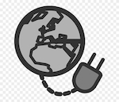
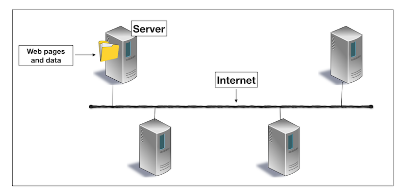

# How does the Internet work?

In this tutorial, you will learn:
* What is the Internet?
* What is an IP address?
* What is a network?
* How do I access the Internet?

Click on the image below to watch a video about how the Internet works or if you prefer to read the guide instead, keep scrolling down.

## What is the Internet?

Think of the Internet as a vast network of wires buried in the ground (and sea) running across the globe. These wires can be cables, or fiber optics, but they can also be wireless signals from satellites or radios - they all carry bits of data and information.

Special computers called _servers_ are connected to this wire(s). Think of these as filing cabinets that store information (files) and pass it on when you ask for them. These servers can communicate with another server that is connected to the wire. All these linked-up computers are what make up the Internet - it is a network of computers.

The Internet just has one job - to move information (known as _data_) from one place to another. Let's look at how this is done.

## What is an IP address?

Every device connected to the Internet has to have an 'address' so that they can be found by another computer (just like a postal address lets the mailman find you). This is called an _Internet Protocol address_ (IP address) and is represented by a series of numbers. For example, the IP address 172.217.7.238 will lead you to the home page of www.google.com. IP addresses let machines find each other on the huge network of computers.  

## The different jobs of computers

We've already spoken of one job of computers - to store files, this is done by servers.
A computer that requests for these files is called a _client_. When you open up a browser - let's say Firefox - and type in www.facebook.com, Firefox is the client asking Facebook's server for the files (Facebook's webpages). 

Yet another type of computer exists on the Internet - these are called _routers_. A router's job is to connect you to the ISP which in turn gets you to the Internet. If you have several computers or devices in your home, a single router connect all of them to the Internet. This is done because the router emits radio waves, and if your computer or device is within the range of those waves, you can connect to the Internet **wirelessly**. This is called a Wifi connection.

