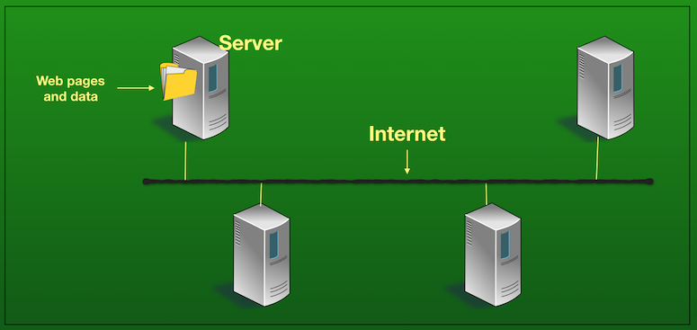
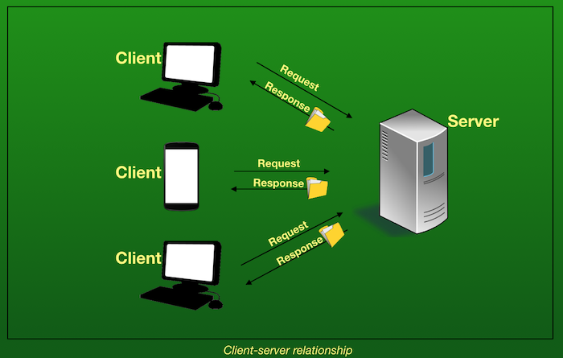
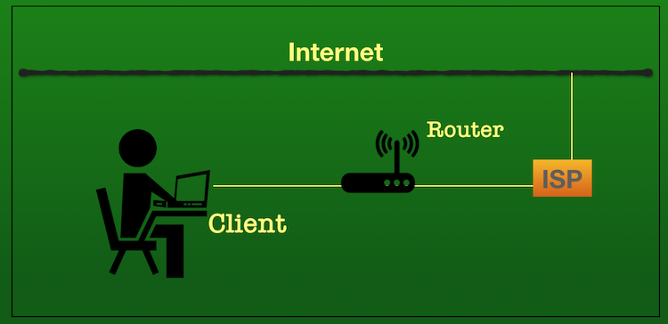
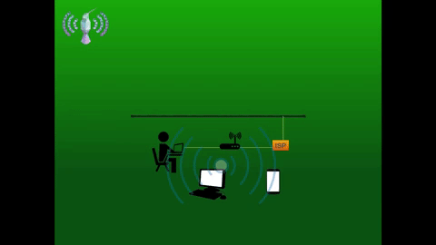

# How does the Internet work?

In this tutorial, you will learn:
* What is the Internet?
* What is an IP address?
* What is a network?
* How do I access the Internet?

Click on the image below to watch a video about how the Internet works or if you prefer to read the guide instead, keep scrolling down.

## What is the Internet?

Think of the Internet as a vast network of wires buried in the ground (and sea) running across the globe. These wires can be cables, or fiber optics, but they can also be wireless signals from satellites or radios - they all carry bits of data and information.

Special computers called **servers** are connected to this wire(s). Think of these as filing cabinets that store information (files) and pass it on when you ask for them. These servers can communicate with another server that is connected to the wire. All these linked-up computers are what make up the Internet - it is a network of computers.

Now that you know what a server is, let's mention two types of servers:
* Local server: This means that you have a server set up on your _current_ machine, it is physically on site with you.
* Remote server: When a server is remote, it is on _another_ computer. You may have heard of the 'cloud' - this is a type of remote server (usually in Data Centres) that you access via the Internet.

So we already know one type of computer - servers - whose job is to store files. A computer that requests for these files is called a **client**. When you open up a browser - let's say Firefox - and type in www.facebook.com, Firefox is the client asking Facebook's server for the files (Facebook's webpages). The server receives the request and returns the web pages back to Firefox.

## What is a network?

At its most basic, a network is two or more computers that are linked in order to communicate with each other. Here are two very common types of networks:
* **Local Area Network (LAN)**: This refers to when a network of computers happens to be in the same physical location - like a school or office building. 
* **Wide Area Network (WAN)**: A WAN connects networks in larger geographic areas like a city, state or a country. A WAN can connect several LANs together.

The Internet just has one job - to move information (known as _data_) from one place to another. Let's look at how this is done.

## What is an IP address?

Every device connected to the Internet has to have an 'address' so that they can be found by another computer (just like a postal address lets the mailman find you). This is called an **Internet Protocol address** (IP address) and is represented by a series of numbers. For example, the IP address 172.217.7.238 will lead you to the home page of www.google.com. IP addresses let machines find each other on the huge network of computers.  

## How do I access the Internet?

When a client wants to access the Internet, it needs to go through a company that lets you use the Internet. This company is called an **Internet Service Provider** (ISP). Yet another type of device called a **router** exists to access the Internet. A router's job is to connect you to the ISP which in turn gets you to the Internet. It looks like this:

If you have several computers or devices in your home or school, a single router will connect all of them to the Internet. This is done because the router emits radio waves, and if your computer or device is within the range of those waves, you can connect to the Internet _wirelessly_. This is called a **Wifi connection**.

